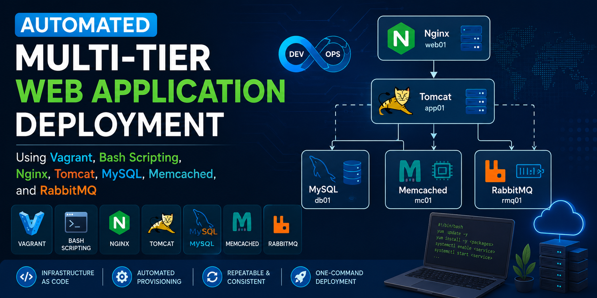
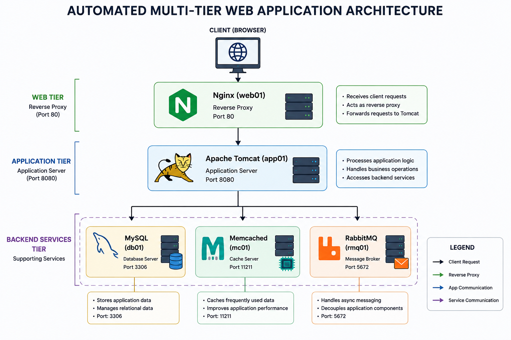

# Automated Multi-Tier Web Application Deployment Using Vagrant, Bash Scripting, Nginx, Tomcat, MySQL, Memcached, and RabbitMQ



## Project Overview

This project demonstrates how to automate the deployment of a complete multi-tier web application environment using **Vagrant**, **VirtualBox**, and **Bash scripting**. The entire infrastructure, including application and supporting services, can be provisioned and configured automatically with a single command.

The project follows Infrastructure as Code (IaC) principles, transforming a previously manual deployment process into a repeatable, automated, and consistent deployment workflow.

---

## Architecture

The application stack consists of five virtual machines:

| VM    | Role               | Technology    |
| ----- | ------------------ | ------------- |
| web01 | Web Server         | Nginx         |
| app01 | Application Server | Apache Tomcat |
| db01  | Database Server    | MySQL/MariaDB |
| mc01  | Cache Server       | Memcached     |
| rmq01 | Message Broker     | RabbitMQ      |

### Architecture Diagram



---

## Features

* Automated multi-VM provisioning using Vagrant
* Infrastructure as Code (IaC) approach
* Automated service installation and configuration
* Automated application deployment
* Reverse proxy configuration with Nginx
* Database provisioning with MySQL/MariaDB
* Message queue setup with RabbitMQ
* Distributed caching with Memcached
* Repeatable and consistent local environments
* One-command deployment

---

## Technologies Used

### Infrastructure & Automation

* Vagrant
* VirtualBox
* Bash Scripting

### Web & Application Layer

* Nginx
* Apache Tomcat
* Maven

### Data & Messaging Layer

* MySQL/MariaDB
* RabbitMQ
* Memcached

### Development Tools

* Git
* Git Bash
* Visual Studio Code

---

## Project Structure

```text
automated-multi-tier-webapp-deployment/
│
├── vagrant
│     ├── Vagrantfile
│     ├── mysql.sh
│     ├── memcache.sh
│     ├── rabbitmq.sh
│     ├── tomcat.sh
│     ├── tomcat_ubuntu.sh
│     └── nginx.sh
│
├── src/
├── images/
├── pom.xml
└── README.md
```

### Provisioning Scripts

| Script       | Description                                 |
| ------------ | ------------------------------------------- |
| mysql.sh     | Installs and configures MariaDB             |
| memcached.sh | Installs and configures Memcached           |
| rabbitmq.sh  | Installs and configures RabbitMQ            |
| tomcat.sh    | Installs Tomcat and deploys the application |
| nginx.sh     | Installs and configures Nginx               |

---

## Prerequisites

Install the following software before starting:

### VirtualBox

Download and install:

[https://www.virtualbox.org](https://www.virtualbox.org)

Verify installation:

```bash
VBoxManage --version
```

### Vagrant

Download and install:

[https://developer.hashicorp.com/vagrant](https://developer.hashicorp.com/vagrant)

Verify installation:

```bash
vagrant --version
```

### Git

Download and install:

[https://git-scm.com](https://git-scm.com)

Verify installation:

```bash
git --version
```

---

## Getting Started

### Clone the Repository

```bash
git clone https://github.com/OlumideOlumayegun/automated-multi-tier-webapp-deployment.git
```

Navigate to the project directory:

```bash
cd automated-multi-tier-webapp-deployment
```

---

## Deploy the Environment

Provision the entire infrastructure with a single command:

```bash
cd vagrant
vagrant up
```

This command automatically:

* Creates all virtual machines
* Configures networking
* Executes provisioning scripts
* Installs required packages
* Configures services
* Deploys the application

Provisioning typically takes between 15 and 30 minutes depending on internet speed.

---

## Provisioning Workflow

The services are provisioned in the following order:

```text
db01
 ↓
mc01
 ↓
rmq01
 ↓
app01
 ↓
web01
```

This sequence ensures that dependencies are available before application deployment begins.

---

## Validation

After deployment completes successfully, open a browser and navigate to:

```text
http://web01
```

or use the static IP configured in the Vagrantfile.

### Validation Checklist

#### Nginx

* Web interface loads successfully.
* Reverse proxy forwards traffic correctly.

#### Tomcat

* Application starts successfully.
* Application pages are accessible.

#### Database

* User authentication works.
* Application data is persisted.

#### RabbitMQ

* Messaging functionality operates correctly.

#### Memcached

* Data caching and retrieval work as expected.

---

## Managing the Environment

### Stop All Virtual Machines

```bash
vagrant halt
```

### Start Existing Virtual Machines

```bash
vagrant up
```

### Check Status

```bash
vagrant status
```

### Destroy the Environment

```bash
vagrant destroy -f
```

---

## Key Learning Outcomes

This project demonstrates:

* Infrastructure as Code (IaC)
* Automated provisioning using Vagrant
* Bash scripting for infrastructure automation
* Multi-tier application deployment
* Reverse proxy configuration with Nginx
* Java application deployment with Tomcat
* Database provisioning and configuration
* Messaging infrastructure with RabbitMQ
* Distributed caching with Memcached
* Repeatable development environments

---

## Skills Demonstrated

* DevOps Engineering
* Infrastructure Automation
* Linux Administration
* Vagrant
* Bash Scripting
* Nginx
* Apache Tomcat
* MySQL/MariaDB
* RabbitMQ
* Memcached
* Maven
* Git
* Infrastructure as Code (IaC)

---

## Future Enhancements

* Replace Bash scripts with Ansible playbooks
* Containerize services using Docker
* Deploy on Kubernetes
* Implement CI/CD pipelines with Jenkins or GitHub Actions
* Add monitoring with Prometheus and Grafana
* Deploy to AWS or Azure cloud infrastructure

---

## Author

**Dr Olumide Olumayegun**

DevOps Engineer | Data Scientist | AI Engineer

*"Bridging DevOps, Data Science, and AI – From Deployment Pipelines to Deep Insights."*
